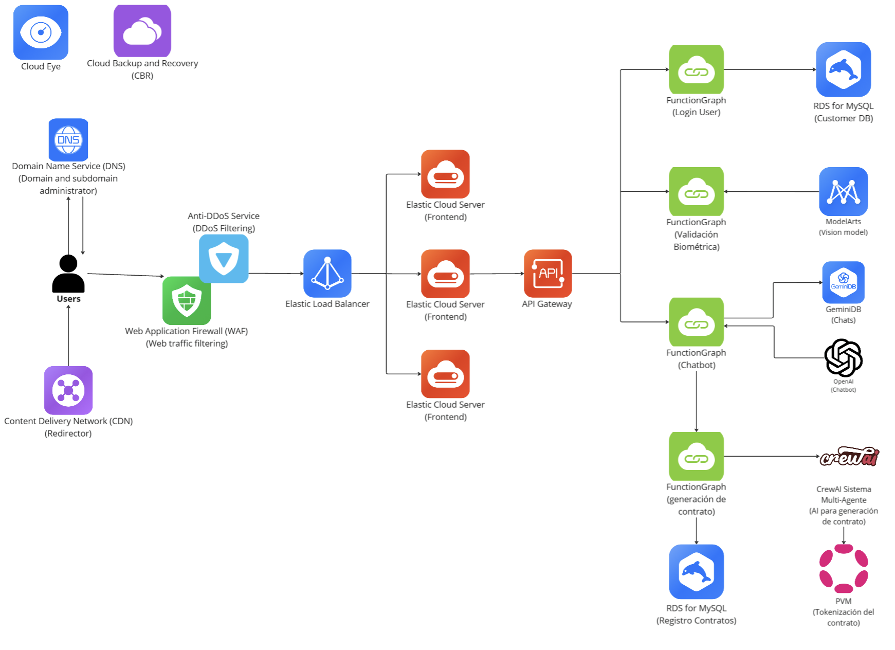
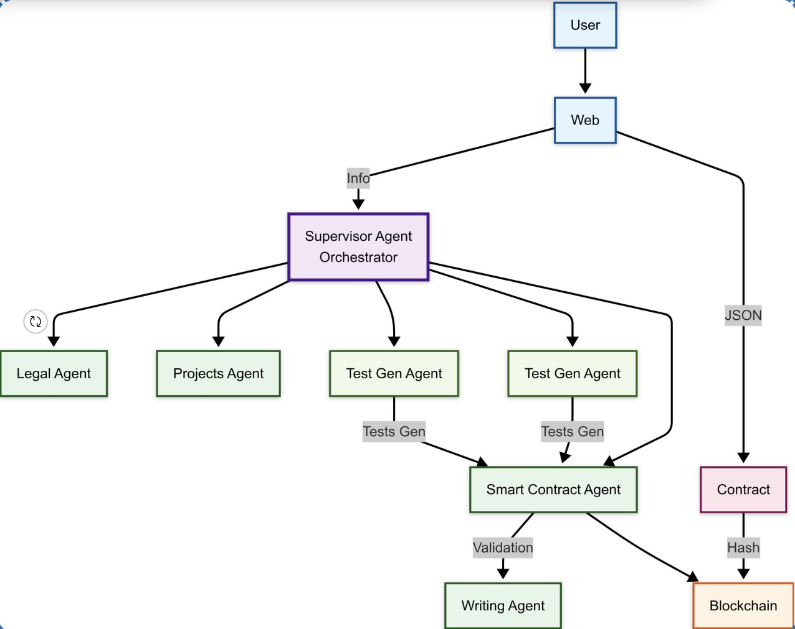

# SecureContract

## Descripción del Proyecto

**SecureContract** es una plataforma “todo-en-uno” que **genera, despliega y ejecuta contratos inteligentes de escrow** para proteger acuerdos entre freelancers y empresas. A través de **tecnología blockchain (Moonbase Alpha)** y herramientas como **Solidity, Hardhat y PVM**, permite definir reglas claras y liberar pagos solo al cumplir los entregables pactados.

Este proyecto fue desarrollado durante la **hackathon NERD CAMP 2025** organizada por **Polkadot**.

---

## Problema que Resolvemos

Muchos freelancers enfrentan:

- Impagos o pagos incompletos.
- Cambios unilaterales en entregables.
- Ausencia de protección en contratos informales.

---

## Nuestra Solución

SecureContract permite:

- Crear contratos en minutos con reglas claras.
- Asegurar pagos por hitos verificados.
- Simular y ejecutar acuerdos en red de pruebas (Moonbase).
- Resolver disputas mediante un árbitro autorizado.

---

## Componentes Clave

- ⚙️ **Solidity** – Lógica del contrato inteligente.
- 🧪 **Hardhat** – Compilación, testing y despliegue.
- 🌕 **Moonbase Alpha (Polkadot)** – Testnet de blockchain.
- 💡 **PVM (Polkadot Virtual Machine)** – Simulación de ejecución.
- 🌐 **API REST** – Backend para operar contratos desde apps.
- 🤖 **Agentes de IA (CrewAI)** – Soporte en redacción, validación y testing de entregables.
- 💻 **Frontend en React/Next.js** – Interfaz para usuarios.

---

## Arquitectura de la Solución

### 🧠 Arquitectura General



### 🧬 Sistema Multi-Agente



---

## Flujo de Trabajo

1. El usuario inicia el proceso mediante el frontend.
2. Se recopilan los requisitos del contrato.
3. Agentes de IA (CrewAI) asisten en la redacción y validación legal.
4. El árbitro despliega el contrato en Moonbase.
5. Empresa1 deposita los fondos de forma segura.
6. Empresa2 entrega los hitos establecidos.
7. El árbitro valida el cumplimiento o ejecuta validaciones automatizadas.
8. El contrato libera los pagos o gestiona cancelaciones según corresponda.

---

## Tecnologías Utilizadas

- **Solidity** para desarrollo de contratos inteligentes
- **Hardhat** para testing y despliegue
- **React/Next.js** para la interfaz de usuario
- **CrewAI** para agentes de inteligencia artificial
- **Moonbase Alpha** como testnet de Polkadot
- **PVM (Polkadot Virtual Machine)** para simular interacciones
- **PostgreSQL + S3** para almacenamiento y persistencia
- **OAuth/SMTP Gmail** para validación de usuarios
- **Vision AI + OCR** para análisis de entregables
- **IPFS** para almacenamiento de hashes

---

## Funcionalidades Principales

- 💬 Generador guiado de contratos
- 🔒 Verificación facial + ID
- 🖊️ Firma digital integrada
- ⛓️ Registro inmutable en blockchain
- 💸 Escrow automático por hitos
- 🧪 Testing AI de URLs/artefactos

---

## Endpoints Principales

**Base URL:** `http://localhost:3000/api`  
**Formato:** JSON  
**Autenticación:** Claves privadas en backend (ver `.env`)  
**Rate Limit:** 100 requests / 15 minutos / IP

### 🔧 Gestión del Sistema

- `GET /api/health` – Verifica el estado del servidor.
- `GET /api/balance/:address` – Consulta balance de una wallet.

### ⚖️ Contratos

- `POST /api/contracts/deploy` – Despliega contrato nuevo.
- `GET /api/contracts/:address` – Obtiene info de contrato.
- `GET /api/contracts` – Lista contratos disponibles.

### ✅ Operaciones

- `POST /api/contracts/:address/complete/:requirementId` – Marca un requerimiento como cumplido.
- `POST /api/contracts/:address/cancel` – Cancela un contrato y devuelve fondos.

> 📄 La documentación completa se encuentra en: `docs_API_ENDPOINTS.md.pdf`

---

## Configuración `.env`

Crea un archivo `.env` en la raíz del backend con la siguiente configuración:

```env
# ========================================
# CONFIGURACIÓN DE RED POLKADOT/MOONBASE
# ========================================
NETWORK_RPC_URL=https://rpc.api.moonbase.moonbeam.network
CHAIN_ID=1287
PORT=3000

# ========================================
# CONFIGURACIÓN DEL ÁRBITRO
# ========================================
ARBITRO_ADDRESS=0x8E30605722f74B211CFCEBb00c38Bc844E620478
ARBITRO_PRIVATE_KEY=028a147c053d64d25505977a287cedd909c7ba01975c7220546a2fee67001ba9

# ========================================
# CONFIGURACIÓN DE EMPRESA 1 (DEPOSITOR)
# ========================================
EMPRESA1_ADDRESS=0x9aFa8e60AE2Df61e3335A847d498aa607B8c6DDD
EMPRESA1_PRIVATE_KEY=86959af5264131e84d995ac0b6d7c8beda98b1966b868e4c3b591c7a2f02772e

# ========================================
# CONFIGURACIÓN DE EMPRESA 2 (BENEFICIARY)
# ========================================
EMPRESA2_ADDRESS=0xBD7E4c530abEE5faF286F6D7dE0f35C7605936b0
EMPRESA2_PRIVATE_KEY=a56f300f849d2d881ea34d875d8013b8b8257411304386d21c87309f6a3c2ee0

# ========================================
# CONFIGURACIÓN LEGACY (para compatibilidad)
# ========================================
PRIVATE_KEY=028a147c053d64d25505977a287cedd909c7ba01975c7220546a2fee67001ba9

CONTRACT_ADDRESS=0xF91020B0fD307d6dE5EAfF9cB496788B9A771EC6
